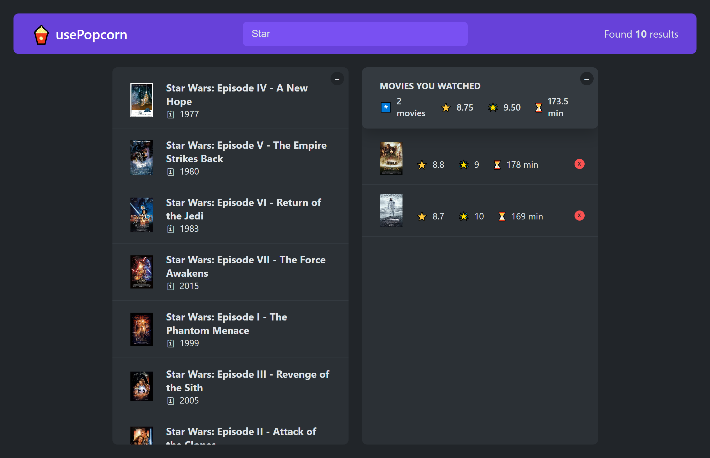

# UsePopCorn

Saving ratings for movies you've watched and rated.

You can view the project live here:
[UsePopCorn](https://use-pop-corn-rating.netlify.app)

---

### Table of Contents

- [Description](#description)
- [Getting Started](#getting-started)
- [References](#references)

---

## Description

- Search bar in which we search with the help of Api all the movies that exist.
- The possibility of rating the desired movie.
- Movie ratings are stored in local storage.

### Technologies

- React

[Back To The Top](#usePopCorn)

---

## Getting Started

To start the project, it is necessary to download the files from the github repository and after that run this commands:
 `'npm i'`   `'npm run start'`

[Back To The Top](#usePopCorn)

---

## References

I made this project with the help of Jonas Schmedtmann in the React course: [React course](https://www.udemy.com/course/the-ultimate-react-course/)

[Back To The Top](#usePopCorn)
